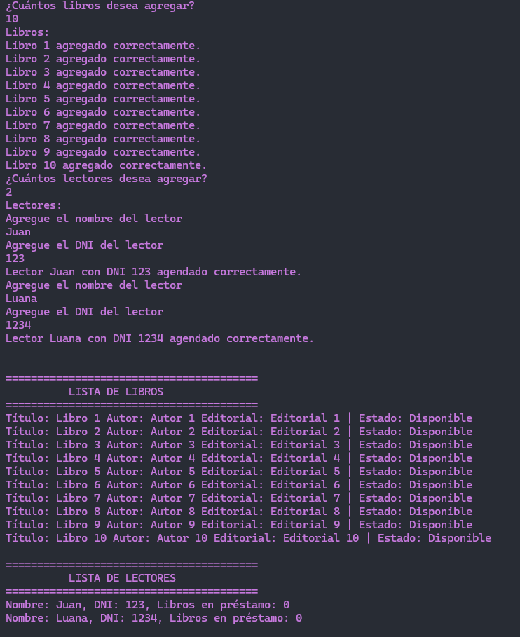
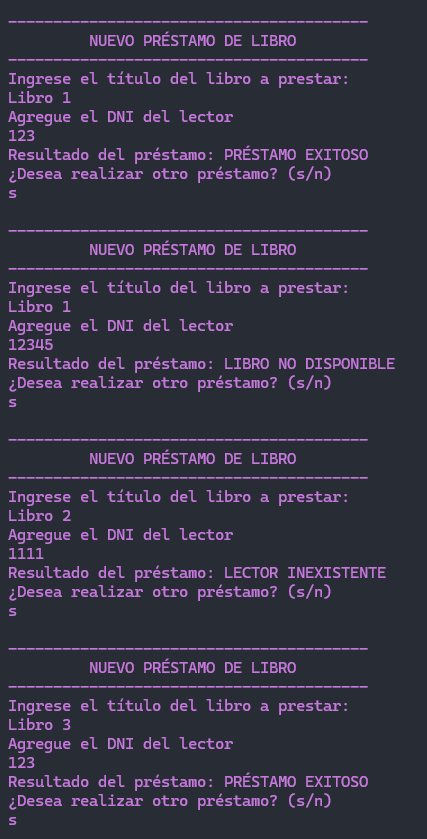
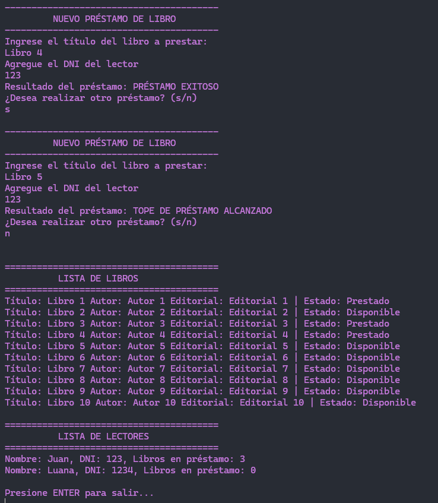

# Trabajo Práctico - Biblioteca

## Tabla de contenidos:

1. **[Requisitos](#Requisitos)**
1. **[Tecnologías usadas](#tecnologías-usadas)**
1. **[¿Cómo instalar el proyecto?](#cómo-instalar-el-proyecto)**
1. **[¿Cómo ejecutar las pruebas?](#cómo-ejecutar-las-pruebas)**
1. **[Ejemplo de la ejecución del test](#Ejemplo-de-la-ejecución-del-test)**

## **Requisitos** <br/>
Usando el ejemplo de la biblioteca  visto durante la semana en la explicación, nos piden como requerimiento que la misma tenga una colección de lectores registrados. De los lectores conocemos su nombre y dni.

Cada lector puede tener hasta un máximo de 3 préstamos vigentes.

Cuando se realiza un préstamo, se extrae de la biblioteca el libro para entregárselo al lector (si es que puede retirarlo).

Es decir, se debe retirar el libro de la lista de libros que posee la biblioteca para asignársele a la lista de libros que posee el lector en préstamo.

Para hacer:
- Ampliar el UML a los nuevos requerimientos.

  Para analizar el UML ingresa a <a href="https://lucid.app/lucidchart/68529457-3976-476f-9b9f-024578fb2d10/edit?viewport_loc=-671%2C508%2C2556%2C1209%2C0_0&invitationId=inv_44012138-c97f-4d2f-bb6b-f86bd7208a4c" target="_blank">Lucid.app</a>
  
- Desarrollar el método altaLector que pasándole los parámetros necesarios de el alta a un lector dentro de la lista de lectores si es que no se encontraba previamente registrado.

- Desarrollar el método prestarLibro de la clase Biblioteca la cual recibe por parámetro el título de un libro y el dni del lector que lo solicita y retorna un string con los posibles valores:
"PRESTAMO EXITOSO" (en este caso el libro se le pudo prestar al lector, se lo quitó de la lista de libros que dispone la biblioteca y se lo adjudicó al lector).
"LIBRO INEXISTENTE" (cuando el libro no se encuentra dentro de la colección de libros en la biblioteca)
"TOPE DE PRESTAMO ALCANZADO" (cuando el lector ya posee tres libros en préstamo).
"LECTOR INEXISTENTE" (cuando el lector no es se encuentra registrado dentro de la colección de lectores en la biblioteca).

- Generar un video grupal, con cámaras activas, donde cada integrante explique parte del desarrollo y funcionamiento del proyecto.

***

## Tecnologías usadas

<p align="left">
<!–– C#––>
<a href="https://learn.microsoft.com/es-es/dotnet/csharp/" target="_blank" data-bs-toggle="tooltip" title="C#">  </a>
 </p>

 ***

## ¿Cómo instalar el proyecto?

#### Desde la terminal:

- Clonar el proyecto:
````
git clone https://github.com/Ana-Galvez/Biblioteca.git
````

- Abrir Visual Studio
- Selecciona el archivo Biblioteca.sln
- Presiona F5 para ejecutar el proyecto.
***

## Ejemplo de la ejecución del test:




